<<<<<<< HEAD
# No-Camera Sample App

RICOH THETA Dream and Build Contest

To apply to the Hardware, this project corresponds to challenge 1 and 2:

This project has been modified and runs on Windows 10 - 32 bits. Three modifications have been made:

1) The file gradle.properties has been added:
org.gradle.jvmargs = -Xmx1024m

2) To the MainActivity.java file has been added:
Bitmap bmpTheta = Bitmap.createScaledBitmap(imgTheta, 800, 400, true);  // Challenge # 1

3) To the MainActivity.java file has been added:
bitmap.compress(Bitmap.CompressFormat.WEBP, 25, byteArrayOutputStream);   // challenge # 2

File apk is in:
no-camera-template-master \ app \ build \ outputs \ apk \ debug \ app-debug.apk

Sample app for Dream and Build contest participants without a camera.
The app reduces RICOH THETA image size from 10.7MB to 0.12MB for
transmission over unstable networks.  The original image file is preserved
in the camera. The idea is to set up a timelapse to take 1,000 pictures,
one image every 5 minutes and transmit the small files automatically.
A person can look at the small image and decide if they want the larger
image.

This app was developed with an Android Studio AVD and
uses actual RICOH THETA images stored in the app. The virtual shutter
button will save the image to the virtual SD card of your AVD.

To use the app with a physical device RICOH THETA V, uncomment
the code at the beginning of `MainActivity.java`. With a 
physical device, you can use the shutter button on the camera
to take a picture.
The shutter button also triggers the automatic processing of the image.

## Simulating Picture Taking

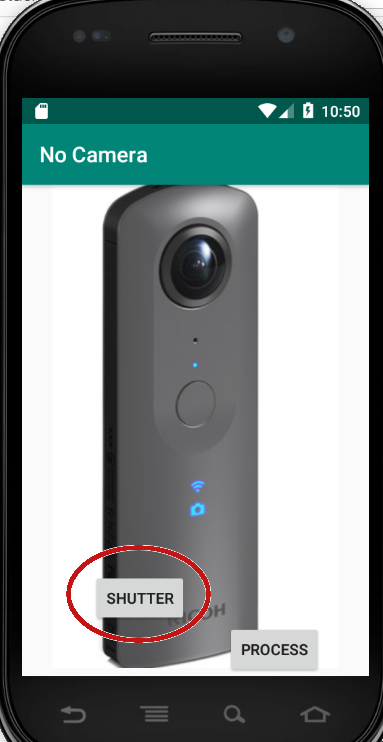

press the shutter button.

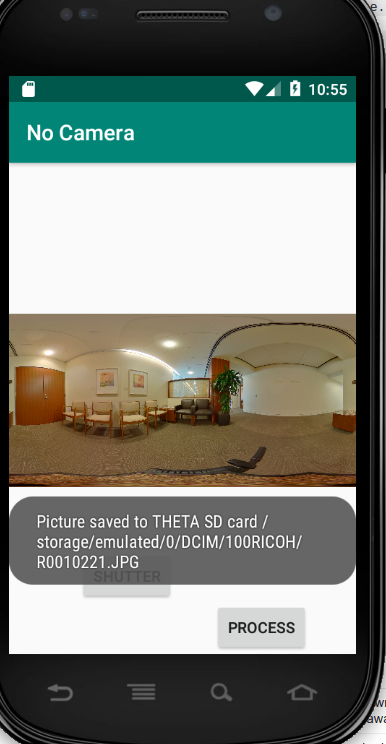

The app will save an actual RICOH THETA V image to the virtual 
SD card of the Android Virtual Device (AVD). The image file
will be saved to `/sdcard/DCIM/100RICOH`. This is mapped to
`/storage/emulated/0/DCIM/100RICOH/` on most devices.

The simulated camera can take four images by default. You can
add additional images to the `assets` folder for testing.

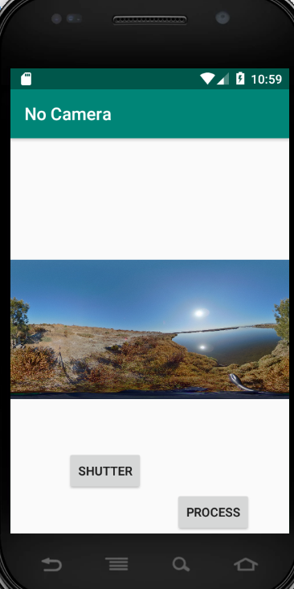

You can log into your AVD to see the files. You can delete the
files and the app will restore the file when you take a picture.

In `MainActivity.java`, there is a method called 
`processImage()`.  Put your image processing code in that method.
It receives a string for the full image path that was just taken
by the RICOH THETA camera.

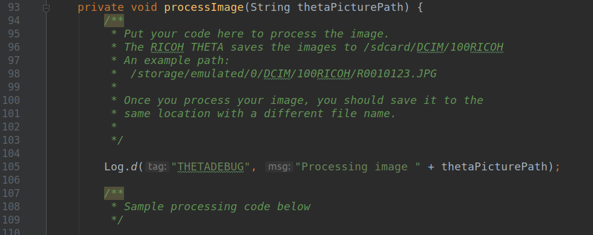

## Image Processing Demo

Developers can process the image inside the camera by 
running common libraries such as TensorFlow or OpenCV. You
can also push the image to a cloud or messaging system. Examples
for all of these plug-ins with GitHub repos of the full code
are included in the Getting Started Guide.

The demo included with this app, reduces the size of a 
RICOH THETA image from 10.7MB to 0.12MB for transmission
over networks.

Take a picture first, then press *PROCESS*. 

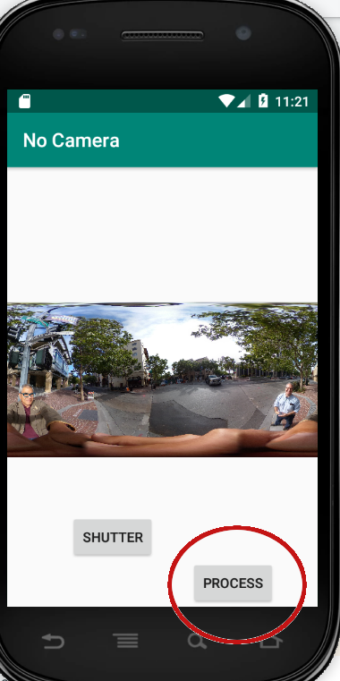

You can see the processed image file in your AVD.

Download the file to your local computer with `adb pull`.

You can now view and analyze the processed file on your local computer.

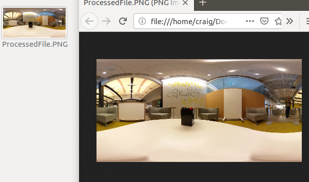

exiftool is useful for inspecting metadata.

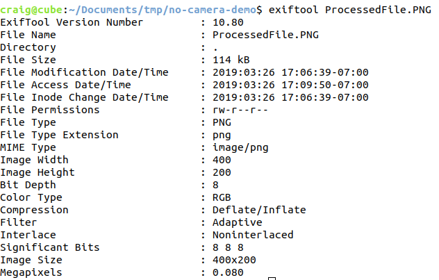

## Metadata

The metadata is stripped out of the images in this example. In particular, the
ProjectionType is not set to equirectangular.  You can add the metadata
in with exiftool for testing.

Once you have the ProjectionType set to equirectangular, the
image will be viewable in 360 apps such as Facebook. Note that the
image resolution is intentionally low to reduce file size
for transmission over unstable cellular networks in remote areas.

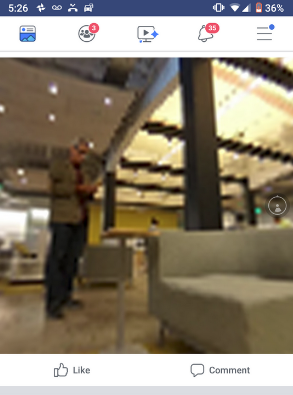

## Loading RICOH THETA Sample Images Manually

You do not need to use this app to store images in your AVD.
You can manually save the images into the correct directory 
with `adb`. 

RICOH THETA V sample images are available here:
 * https://community.theta360.guide/t/sample-media-and-development-resources/3754

If you do not have a camera, load the sample image into /sdcard/DCIM/100RICOH with
 
    adb push /sdcard/DCIM/100RICOH/R0010123.JPG

Log into your AVD with:

    adb shell
    cd /sdcard/DCIM/100RICOH
    
Check to see that the image is installed in the proper directory.

## App Permissions

To use this app, you must set the permissions in *Settings*.

In Android Virtual Device, select Setting -> Apps to
enable storage permissions.

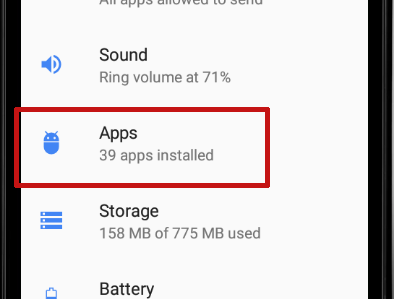

Select app _No Camera Demo_

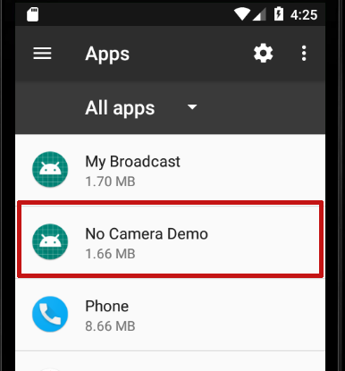

Select permissions.

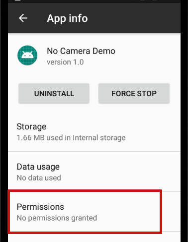

Enable _Storage_ permissions.

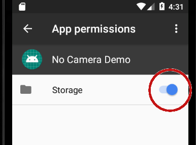

## Finishing RICOH THETA Plug-in

If you're working on a submission for the [2019 Dream and Build 
Contest](https://community.theta360.guide/t/dream-and-build-developers-contest-now-taking-entries/4205?u=codetricity)
and do not have a RICOH THETA camera,
Oppkey may be able to help you add the functionality needed to
complete your plug-in on actual RICOH THETA hardware.
If you need help, please post in the forum at the link above.

=======
# ricoh-theta-challenges
 Project repository: "Challenges 1 and 2"
>>>>>>> e783406e58658c4ca90e6b1074f45fc8c82fd120
